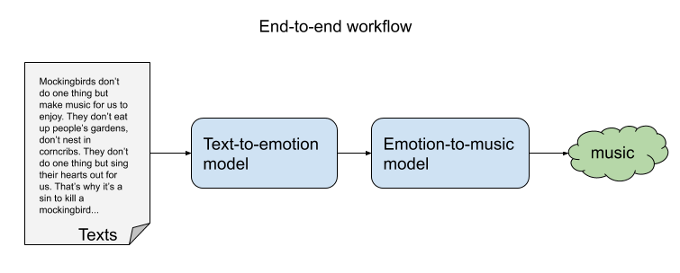
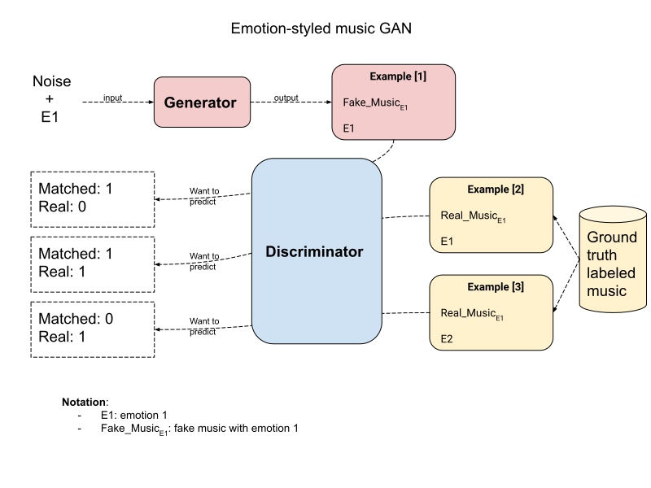
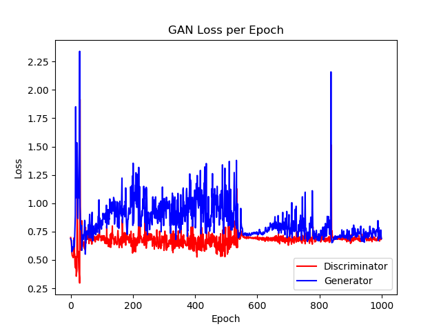

# CS230 Project: Literary Muzak

## Prerequisites

> __Below we assume the working directory is the repository root.__

### Install dependencies

- Create a virtual environment

  ```sh
  conda create -n text_to_music python=3.6
  ```

- Using pip

  ```sh
  # Install the dependencies
  pip install -r requirements.txt
  ```
  
### Train the network
Folder 'midi-lstm-gan': It contains a conditional GAN with bi-directional LSTM generator/discriminator.

  ```sh
  cd midi-lstm-gan
  python mlp_gan.py
  ```
  After the script ran, it generates 10 songs for each emotions (1 = Sad, 2 = Happy, 3 = Scary, 4 = Peaceful) in the "midi-lstm-gan/results" folder. And it also generates a loss plot by epochs in midi-lstm-gan folder.
  
Folden 'GAN' contains code for a normal LSTM model we tried, we didn't use it in the end because it didn't perform well.


## Datasets

The initial dataset we used to jump start the emotion to music generation model is [Music and Emotion Datasets](https://doi.org/10.7910/DVN/IFOBRN) from Harvard Dataverse. There are 200 .wav sounds corresponding to the design matrix. The design matrix has a Melody column has 4 categories of emotions for the corresponding music, i.e 1 = Sad, 2 = Happy, 3 = Scary, 4 = Peaceful.

We prepared the datasets by converting all .wav files in one folder to .mid (MIDI) suffix using the following script. The conversion tool it is based on [audio_to_midi_melodia](https://github.com/justinsalamon/audio_to_midi_melodia).  

  ```sh
  # WAV to midi conversion
  cd scripts
  ./wav_to_midi.sh
  ```
  
We also trained the model based on the other datasets without emotion label:
1) [Pokemon music](https://github.com/corynguyen19/midi-lstm-gan/tree/master/Pokemon%20MIDIs) - 307 Songs
   We mark the songs from Pokemon collection as "Happy" 
2) [Pop music](https://github.com/burliEnterprises/tensorflow-music-generator/tree/master/Pop_Music_Midi) - 88 Songs
3) [Final Fantasy music](https://github.com/Skuldur/Classical-Piano-Composer/tree/master/midi_songs) - 92 Songs
 
## Sample Songs

* Better Examples:
  We encoded the emotions as 10% of the note sequence. 
  * [happy song](https://onlinesequencer.net/1302166)
  * [sad song](https://onlinesequencer.net/1302165)
  * [scary song](https://onlinesequencer.net/1302163)
  * [peaceful song](https://onlinesequencer.net/1302167)
 
The songs are kinds of similar as of now, our future work can be get more training data from each emotion.
Also, one good side to output midi is we can convert the notes to any instrument to fit better to the emotion, in the future, we can consider the instrument in our model as well.

* Bad Examples: [song1](https://onlinesequencer.net/1302194). 
  We first encoded the emotions as a large portion (50%) of the note sequence in the Train_X input the song came out with many repetitve notes.

## End-to-end workflow



## Text to emotion

Our current text to emotion model is based on [Multi-class Emotion Classification for Short Texts](https://github.com/tlkh/text-emotion-classification). The model uses "multi-channel" combinations of convolutional kernels (ala CNN) and Long Short-Term Memory (LSTM) units to classify short text sequences (in our case, tweets) into one of five emotional classes, as opposed to the typical binary (positive/negative) or ternary (positive/negative/neutral) classes. 

The model performance achieved a positive result by achieving more than 62% overall classification accuracy and precision. In particular, they have achieved good validation accuracy on happy, sad, hate and anger (91% precision!) classes.

We will improve the model performamce in the context of music as the future work. We are planning to use music lyrics to train the model as well.

## Emotion to music 



We train a C-GAN (Conditional GAN):
- Generator, with inputs an emotion E and white noise WN, will learn to generate emotion-styled music M from tweaking the noise, to fool the Discriminator into thinking it's real music with the emotion it claims to have.
- Discriminator, with input music M and emotion label E, will learn to tell two things:
  - Whether the music is real or fake.
  - Whether the emotion E matches the emotion from music M.
  
## Loss vs Epochs
We trained the C-GAN on AWS EC2 instance with GPU for 1000 epochs, it took about 4 hours to finish. The discriminator and generator is kind of converage to a loss of 0.75. If trained longer, or fed into more training data, we are expecting eventually they should converage at 0.5.


## Discriminator Architecture


## Generator Architecture


